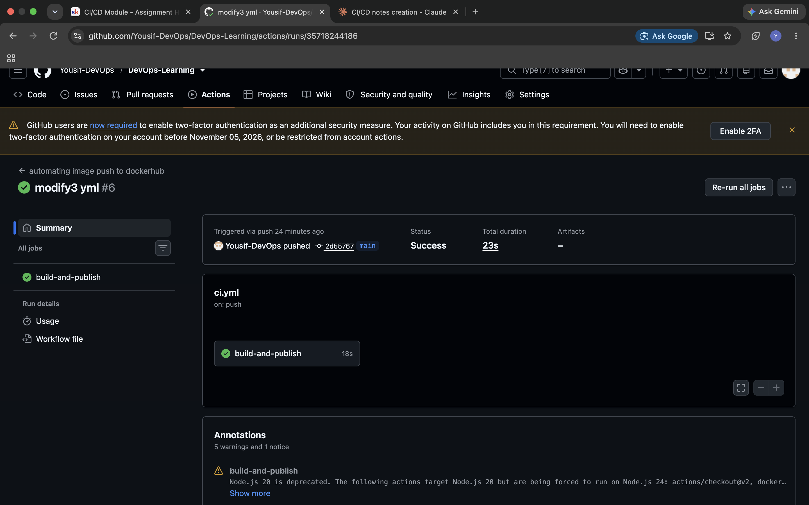

# Task 2 — CD Workflow: Docker Build & Push

## What I Built

An automated CI/CD pipeline using GitHub Actions that builds a Docker image
from a simple Python app and pushes it to Docker Hub automatically on every
push to the `main` branch.

## How It Works

1. Code is checked out from the repository
2. The workflow logs in to Docker Hub using GitHub Secrets
   (`DOCKER_USERNAME` and `DOCKERHUB_TOKEN`)
3. The Docker image is built from the `Dockerfile`
4. The image is tagged with the short commit SHA and pushed to Docker Hub
5. If the push is on the `main` branch, a second "release candidate" tag
   (`rc-<sha>`) is also pushed; otherwise it's tagged as `alpha-<sha>`

## Files

- `app.py` — the simple Python application
- `Dockerfile` — builds the container image
- `ci.yml` — the GitHub Actions workflow (copy for documentation;
  the live version runs from `.github/workflows/ci.yaml`)

## Screenshots

## What I Learned

- How to authenticate GitHub Actions with Docker Hub using repository secrets
- How to dynamically tag Docker images using the commit SHA for traceability
- How to conditionally tag images differently based on the branch
  (`main` vs. other branches)
- That `docker/login-action` and `docker/build-push-action` versions matter —
  and that secret names must match *exactly* between the workflow file and
  what's configured in GitHub Settings

## Issues I Solved

- **Path mismatch**: the workflow initially failed with
  `no such file or directory` because the `cd` command pointed to a folder
  (`hello-app`) that didn't actually exist in the repo. Fixed by checking
  the real file structure on GitHub and correcting the path to
  `08-cicd/projects`.
- **Invalid workflow YAML**: an edit accidentally removed the top-level
  `name:`, `on:`, and `jobs:` keys, causing GitHub to reject the file
  entirely ("a sequence was not expected"). Fixed by rewriting the file
  from scratch with the correct structure.
- **Docker Hub token permissions**: the first personal access token was
  created with "Public Repo Read-only" access, which isn't enough to push
  images. Regenerated the token with Read & Write permissions.